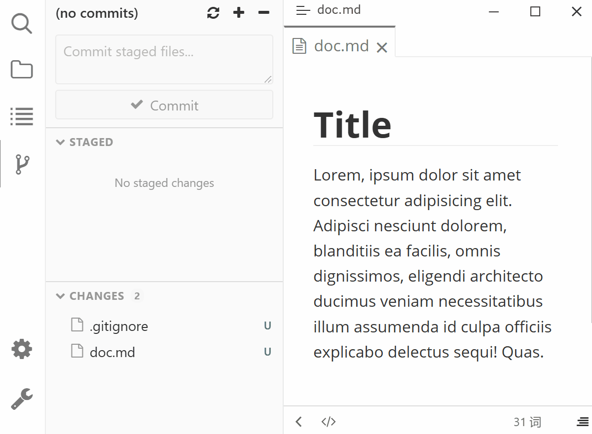

# Typora Plugin Git

[English](./README.md) | 中文

为 [Typora](https://typoraio.cn) 提供基于 [typora-community-plugin][core] 的插件。

## 功能

- 在活动栏打开 **Git** 侧边栏，按目录树展示「已暂存」与「更改」两个区域，并显示每个文件的变更状态（M/A/D/R/C/U）
- 支持对单个文件或整个文件夹进行暂存 / 取消暂存，也支持一键全部暂存、全部取消暂存
- 在侧边栏输入提交信息后直接提交已暂存的更改（`Ctrl + Enter` 快速提交）
- 点击未暂存的**修改文件**打开只读的内联 Diff 视图；点击**删除的文件**查看其在 `HEAD` 的内容；其余文件直接在编辑器中打开
- 当前文件夹不是 git 仓库时，可直接在侧边栏初始化仓库

## 预览

## 设置

| 设置项 | 说明 | 默认值 |
|--------|------|--------|
| 刷新间隔（毫秒） | 面板轮询 git 状态的间隔，最小 `300`；Typora 未处于活动状态时会暂停刷新 | `1000` |

## 安装

1. 安装 [typora-community-plugin][core]
2. 打开 "设置 -> 插件市场"（Settings -> Plugin Marketplace），搜索 **Git** 并安装。

> 注意：系统需已安装 Git，且 `git` 可被加入 PATH 调用。

[core]: https://github.com/typora-community-plugin/typora-community-plugin
